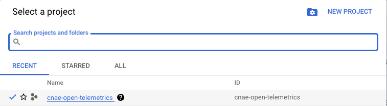

# Google Cloud Platform (GCP) - Terraform

These instructions and commands provided will assume that the current path is `iac/gcp`.

## Requirements

- [Google Cloud Platform (GCP) Account](https://cloud.google.com/)
- [Terraform](https://developer.hashicorp.com/terraform/tutorials/gcp-get-started/install-cli?in=terraform%2Fgcp-get-started). Tip: In mac use `brew install terraform`
- [Google Cloud CLI](https://cloud.google.com/sdk/docs/install). Tip: Use brew `brew install --cask google-cloud-sdk`

## Steps

### Terraform

Follow the documentation to use GCP provider in terraform: [https://registry.terraform.io/providers/hashicorp/google/latest/docs](https://registry.terraform.io/providers/hashicorp/google/latest/docs)

1. Create a GCP Project **cnae-open-telemetrics**. Hint: Take the project id.

2. In the file, variables.tf, replace the project_id with the project id created in the previous step.
3. Configure Google cloud cli with the project
```shell
gcloud init
```
4. Authenticate with Google cloud cli
```shell
gcloud auth application-default login
```
5. Enable Compute Engine API [here](https://console.cloud.google.com/apis/library/compute.googleapis.com?project=cnae-open-telemetrics)
6. Enable Kubernetes API [here](https://console.cloud.google.com/apis/library/container.googleapis.com?project=cnae-open-telemetrics)
7. Install gcloud-auth-plugin
```shell
gcloud components install gke-gcloud-auth-plugin
```
8. Execute terraform
```shell
terraform init
terraform apply
```
8. Connect to the kubernetes cluster already created
```shell
gcloud container clusters get-credentials gke-cnae-cluster --region $(terraform output -raw region) --project $(terraform output -raw project_id)
```

### Kubernetes

Open telemetry steps

1. Invoke script
```shell
kubectl apply -k ../../kubernetes/kustomize
```

#### Access to the microservices

**Alternative 1**

Connect to a tunel using kubernetes to access the opentelemetry-demo-frontendproxy

```shell
kubectl port-forward -n otel-demo svc/opentelemetry-demo-frontendproxy 8080:8080
```

**Alternative 2:**

To forward with the Google cloud load balancer run:

```shell
kubectl apply -f ingress.yaml
```

## Destroy

In order to destroy:

```shell
kubectl delete -f ingress.yaml
kubectl delete --namespace otel-demo -f ../../kubernetes/opentelemetry-demo.yaml
terraform destroy
```
